# Claude Cat Mod 🐱

A tiny pixel-art cat that lives above your [Claude Code](https://claude.com/claude-code) prompt. It wanders around, watches your usage limits, and tells you when Claude finishes.


## What it does

- **Wanders** back and forth above the prompt, sits down now and then, and blinks.
- **Runs while Claude works**, with a speech bubble showing the current tool (`‹Bash…›`).
- **Announces when a turn finishes** (`‹done! 42s›`), plus a toast for turns longer than 20 seconds.
- **Reacts to failures** with a `>.<` face when a tool call errors.
- **Tracks your limits:** shows your 5-hour, 7-day and context usage in green, yellow or red. It gets sleepy at 80% of the 5-hour limit and sends a toast at 75% and 90%.
- **Keeps itself busy while you're idle**, mostly calmly (strolling, sitting, grooming itself, napping), with play now and then:
  - chases a ball of yarn, follows a butterfly, hops around, and takes little cat naps
  - hunts a mouse, and sometimes pins it under a paw (before it wriggles free and runs off)
  - stalks a bird, pounces ("nom?!"), and watches it fly away
  - goes fishing: a fishbowl, a fish tank or a river, depending on the scene, and sometimes catches one
  - chases a laser pointer dot back and forth until it vanishes ("where'd it go?")

  

  
- **Goes to bed on its perch** after 5 minutes of inactivity, or when your 5-hour limit runs out. The perch slides in from the left (a cat bed, a tree stump, a cloud or a cat tree, depending on the scene), the cat walks over, hops up and curls up. On your next prompt it wakes and the perch slides away.

  
- **Speech bubbles** that type themselves out, with animated dots, hearts and sparkles.
- **Little animations** in between: tail wags, ear twitches, a shake when something fails, and drifting z's while it naps.
- **Pet ♥** button (it purrs, with floating hearts, and wakes up if it was asleep) and **Hide** button.
- **⚙ Settings**, saved across sessions:
  - **Coat:** Orange, Tuxedo, Black, Grey, Cream or Sakura

    

  - **Speed:** Chill, Normal or Zoomies
  - **Scene:** Clear (follows your light/dark theme), Grass, Night or Cozy. The scene also picks the perch and the fishing spot.
  - **Popups:** on or off
  - **Usage:** show or hide the limit numbers
- **`/cat`** toggles it and prints your current limits and when the 5-hour window resets.

In the Claude desktop app the whole lane is one SVG that animates itself (smooth gliding, leg and tail frames, blinks, floating hearts and z's), so the mod only redraws when the cat changes what it's doing. In the terminal the lane is a cell grid of colored half blocks, repainted in place 10 times a second.

## Install

You need a Claude Code version that supports mods (October 2026 or later).

```bash
git clone https://github.com/matthlh/claude-cat-mod ~/.claude/mods/claude-cat
```

**For one session:**

```bash
claude --plugin-dir ~/.claude/mods/claude-cat
```

**For every session**, in every project and in the desktop app, add this to `~/.claude/settings.json` (merge it into the `env` block if you already have one):

```json
{
  "env": {
    "CLAUDE_CODE_PLUGIN_DIRS": "/Users/<you>/.claude/mods/claude-cat",
    "CLAUDE_CODE_ENABLE_FUNCTION_HOOKS": "1"
  }
}
```

- `CLAUDE_CODE_PLUGIN_DIRS` tells Claude Code where the mod is. It takes absolute paths; separate several folders with `:`.
- `CLAUDE_CODE_ENABLE_FUNCTION_HOOKS` turns mods on. They're still rolling out, so without it a session may load the mod's files but not run it.

Then start a new session. Sessions that were already open when you changed the settings won't pick it up until they restart (in the desktop app, start a new chat or quit and reopen the app).

## Customize

The sprites are 12×10 grids of letters in [`hooks/register.tsx`](hooks/register.tsx):

| Letter | Color |
| --- | --- |
| `o` | fur (Claude orange) |
| `d` | shade |
| `H` / `K` | eye shine / eye |
| `r` | blush |
| `n` | nose |
| `w` | chest |

Edit the grids or the `PALETTE` to make a tuxedo, calico or black cat. In an interactive session, saving the file hot-reloads the mod.

Check your changes with:

```bash
claude plugin validate ~/.claude/mods/claude-cat
claude plugin test ~/.claude/mods/claude-cat
```

The tests draw the band on the desktop and terminal surfaces, press the buttons, and draw every activity and perch in every scene, so a drawing the engine would refuse fails there instead of silently disappearing.

## Heads-up

Mods run with the same access to your machine as Claude Code itself; they are not sandboxed. This one only reads session usage and draws UI, but read any mod before you install it.

## License

MIT
