# Claude Cat Mod 🐱

A tiny pixel-art cat that lives above your [Claude Code](https://claude.com/claude-code) prompt. It wanders around, watches your usage limits, and tells you when Claude finishes.


## What it does

- **Wanders** back and forth above the prompt, sits down now and then, and blinks.
- **Works alongside Claude**, with a speech bubble showing the current tool (`‹Bash…›`) and a prop to match: a book for reading files, a laptop it types on for edits, a terminal for shell commands, a magnifying glass for searches. Between tools it runs around.
- **Announces when a turn finishes** (`‹done! 42s›`), plus a toast for turns longer than 20 seconds.
- **Reacts to failures** with a `>.<` face when a tool call errors.
- **Food bowl = context:** a bowl at the right end empties as the conversation fills up. Near the limit the cat mentions it; when the conversation is compacted, the bowl refills ("nom nom!").
- **Tracks your limits:** shows your 5-hour, 7-day and context usage in green, yellow or red. It gets sleepy at 80% of the 5-hour limit and sends a toast at 75% and 90%.
- **Keeps itself busy while you're idle**, mostly calmly (strolling, sitting, grooming itself, napping), with play now and then:
  - chases a ball of yarn, follows a butterfly, hops around, and takes little cat naps
  - hunts a mouse, and sometimes pins it under a paw (before it wriggles free and runs off)
  - stalks a bird, pounces ("nom?!"), and watches it fly away
  - goes fishing: a fishbowl, a fish tank or a river, depending on the scene, and sometimes catches one
  - chases a laser pointer dot back and forth until it vanishes ("where'd it go?")
  - **mischief:** finds a mug on a table, taps it… and knocks it off ("*CRASH*", "oops :3"), or sits right on top of your usage stats until you pet it
  - **at night** (11pm–6am) it mostly naps

  

  

  
- **Goes to bed on its perch** after 5 minutes of inactivity, or when your 5-hour limit runs out. The perch slides in from the left (a cat bed, a tree stump, a cloud or a cat tree, depending on the scene), the cat walks over, hops up and curls up. On your next prompt it wakes and the perch slides away.

  
- **Speech bubbles** that type themselves out, with animated dots, hearts and sparkles.
- **Little animations** in between: tail wags, ear twitches, a shake when something fails, and drifting z's while it naps.
- **Your own cat:** each install rolls a marking (a white blaze, socks, a tail tip or a spot) and has a 1 in 50 chance of being ✨ shiny, with sparkles. `/cat` shows yours.
- **Hats to unlock:** a party hat at 10 finished tasks, a beanie at 100 tool calls, a crown at 150 tasks and a wizard hat at 500 tool calls. You get a popup when one unlocks; wear it from ⚙ → Hat.
- **Time of day:** the Grass scene gets dawn, dusk and starry-night skies, the Cozy room gets a window showing the sky outside (with the moon at night), and Clear shows a few stars at night.
- **Pet ♥** button (it purrs, with floating hearts, and wakes up if it was asleep) and **Hide** button.
- **⚙ Settings**, saved across sessions:
  - **Coat:** Orange, Tuxedo, Black, Grey, Cream or Sakura

    

  - **Speed:** Chill, Normal or Zoomies
  - **Scene:** Clear (follows your light/dark theme), Grass, Night or Cozy. The scene also picks the perch and the fishing spot.
  - **Popups:** on or off
  - **Hat:** any you've unlocked
  - **Usage:** show or hide the limit numbers
- **`/cat`** toggles it and prints your current limits and when the 5-hour window resets.

In the Claude desktop app the whole lane is one SVG that animates itself (smooth gliding, leg and tail frames, blinks, floating hearts and z's), so the mod only redraws when the cat changes what it's doing. In the terminal the lane is a cell grid of colored half blocks, repainted in place 10 times a second.

## Install

You need a Claude Code version that supports mods (October 2026 or later). The same steps work on macOS, Linux and Windows. At the Claude Code prompt, type:

```
/plugin install pixel-cat --marketplace matthlh/claude-cat-mod
```

Answer `y` to add the marketplace, then press Enter to install it for your user. The cat shows up right away, and in every new session after that, desktop app included.

Or from a shell:

```bash
claude plugin marketplace add matthlh/claude-cat-mod
claude plugin install pixel-cat@matthlh
```

Update with `claude plugin update pixel-cat@matthlh`, remove with `claude plugin uninstall pixel-cat@matthlh`.

**No cat?** Mods are still rolling out. Add `"CLAUDE_CODE_ENABLE_FUNCTION_HOOKS": "1"` to the `env` block of `~/.claude/settings.json` and start a new session.

### From a clone

To change the cat, run your own copy instead:

```bash
git clone https://github.com/matthlh/claude-cat-mod ~/.claude/mods/pixel-cat
claude --plugin-dir ~/.claude/mods/pixel-cat
```

To load the clone in every session, including the desktop app, put its full path in the `env` block of `~/.claude/settings.json`:

```json
{
  "env": {
    "CLAUDE_CODE_PLUGIN_DIRS": "/Users/<you>/.claude/mods/pixel-cat",
    "CLAUDE_CODE_ENABLE_FUNCTION_HOOKS": "1"
  }
}
```

| OS | Path | Separator for several folders |
| --- | --- | --- |
| macOS | `/Users/<you>/.claude/mods/pixel-cat` | `:` |
| Linux | `/home/<you>/.claude/mods/pixel-cat` | `:` |
| Windows | `C:\\Users\\<you>\\.claude\\mods\\pixel-cat` (JSON needs the doubled `\\`) | `;` |

Write the full path. Older versions don't expand `~` here, so `~/.claude/mods/pixel-cat` silently loads nothing. Sessions already open when you change settings pick it up only after a restart.

## Customize

The sprites are 12×10 grids of letters in [`hooks/packs/cat/sprites.ts`](hooks/packs/cat/sprites.ts):

| Letter | Color |
| --- | --- |
| `o` | fur (Claude orange) |
| `d` | shade |
| `H` / `K` | eye shine / eye |
| `r` | blush |
| `n` | nose |
| `w` | chest |

Edit the grids or the `COATS` to make a tuxedo, calico or black cat. In an interactive session, saving the file hot-reloads the mod.

Everything the cat is lives in one pack, [`hooks/packs/cat/`](hooks/packs/cat): its sprites, coats, scenes, hats and activities. The lane machinery in [`hooks/engine/`](hooks/engine) reads a pack through the interface in [`hooks/packs/types.ts`](hooks/packs/types.ts), so a new pack is one folder plus a line in [`hooks/packs/index.ts`](hooks/packs/index.ts). An activity is one entry in the pack's `activities`: its weights, how it moves, its pose, what it leads into, its lines, and its drawing on both surfaces. The engine names only two activity ids itself, bedtime's `bed` and `perch`; they are reserved, and [`hooks/packs/index.ts`](hooks/packs/index.ts) refuses a pack that defines either, or whose `roles` name an activity it doesn't have.

Check your changes with:

```bash
claude plugin validate ~/.claude/mods/pixel-cat
claude plugin test ~/.claude/mods/pixel-cat
```

The tests draw the band on the desktop and terminal surfaces, press the buttons, and draw every activity of every pack and the bed in every scene, so a drawing the engine would refuse fails there instead of silently disappearing. They also follow every activity's `then` and fail on one that leads nowhere, since a typo there would otherwise become a plain wander.
