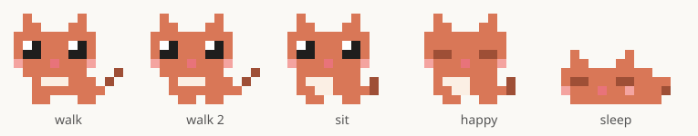
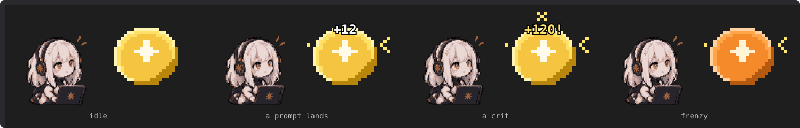
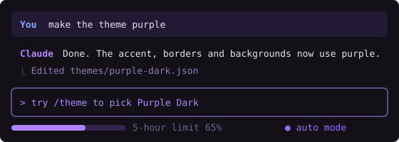

# Claude Code mods by matthlh

Three mods for [Claude Code](https://claude.com/claude-code), served from one plugin marketplace: a pixel cat and an idle game that live above the prompt, and a purple theme.

| Plugin | What it is |
| --- | --- |
| [`pixel-cat`](plugins/pixel-cat) | A little pixel cat that wanders above the prompt, watches your usage limits and announces when work finishes |
| [`token-tycoon`](plugins/token-tycoon) | A Claude-themed idle game: prompt to earn tokens, hire agents, upgrade models and infra, and earn from your real Claude Code usage |
| [`purple-dark`](plugins/purple-dark) | A purple dark colour theme |

## Install

You need a Claude Code version that supports mods (October 2026 or later). The same steps work on macOS, Linux and Windows, in the terminal and in the desktop app. At the Claude Code prompt, add the marketplace once, then install what you want:

```
/plugin marketplace add matthlh/claude-mods
/plugin install pixel-cat@matthlh
/plugin install token-tycoon@matthlh
/plugin install purple-dark@matthlh
```

Or from a shell:

```bash
claude plugin marketplace add matthlh/claude-mods
claude plugin install pixel-cat@matthlh
```

Two things to know:

- **Mods need function hooks.** They're still rolling out, so if nothing shows up above the prompt, add `"CLAUDE_CODE_ENABLE_FUNCTION_HOOKS": "1"` to the `env` block of `~/.claude/settings.json`:

  ```json
  {
    "env": {
      "CLAUDE_CODE_ENABLE_FUNCTION_HOOKS": "1"
    }
  }
  ```

- **Restart after changing settings.** Sessions already open pick up a new plugin or env change only after a restart. In the desktop app, quit it fully (⌘Q), not just the window.

The theme needs no env flag: after installing `purple-dark`, pick **Purple Dark** in `/theme`.

Update a mod with `claude plugin update <name>@matthlh`, remove it with `claude plugin uninstall <name>@matthlh`.

## The mods

### Pixel Cat 🐱



Wanders back and forth above the prompt, works alongside Claude with a prop for each tool, announces when a turn finishes, tracks your 5-hour, 7-day and context limits, plays when you're idle and goes to bed on its perch when you're away. Coats, scenes, hats to unlock, and `/cat` to toggle it. [Read more](plugins/pixel-cat/README.md).

### Token Tycoon 🤖



Cookie Clicker, but the cookie is a token. Prompt ⚡ to earn, hire agents that earn per second, upgrade models and infra, and let your real Claude Code work count: every tool call is a free prompt and every finished turn starts a frenzy. `/idle` opens the shop. [Read more](plugins/token-tycoon/README.md).

### Purple Dark 💜



A purple take on the dark theme: lavender accent, violet borders, deep purple message backgrounds. [Read more](plugins/purple-dark/README.md).

## Run from a clone

To change a mod, run your own copy instead of the marketplace install:

```bash
git clone https://github.com/matthlh/claude-mods ~/.claude/mods/claude-mods
claude --plugin-dir ~/.claude/mods/claude-mods/plugins/pixel-cat
```

To load it in every session, including the desktop app, put the plugin folder's full path in the `env` block of `~/.claude/settings.json`:

```json
{
  "env": {
    "CLAUDE_CODE_PLUGIN_DIRS": "/Users/<you>/.claude/mods/claude-mods/plugins/pixel-cat",
    "CLAUDE_CODE_ENABLE_FUNCTION_HOOKS": "1"
  }
}
```

| OS | Path | Separator for several folders |
| --- | --- | --- |
| macOS | `/Users/<you>/.claude/mods/claude-mods/plugins/pixel-cat` | `:` |
| Linux | `/home/<you>/.claude/mods/claude-mods/plugins/pixel-cat` | `:` |
| Windows | `C:\\Users\\<you>\\.claude\\mods\\claude-mods\\plugins\\pixel-cat` (JSON needs the doubled `\\`) | `;` |

Write the full path. Older versions don't expand `~` here, so a `~` path silently loads nothing. Don't run a clone and the marketplace install of the same mod at once.

## Develop

Each mod is a plugin of function hooks under `plugins/<name>/`, with its tests beside it. Check a change with:

```bash
claude plugin validate .                       # the marketplace
claude plugin validate plugins/pixel-cat       # one plugin
claude plugin test plugins/pixel-cat           # its tests
```

In an interactive session that loads the clone, saving a hooks file hot-reloads the mod.

## Layout

```
.claude-plugin/marketplace.json   the marketplace: one entry per plugin
plugins/pixel-cat/                hooks, tests, types, docs, README
plugins/token-tycoon/             hooks, tests, types, docs, README
plugins/purple-dark/              themes/purple-dark.json, docs, README
```

## License

MIT
