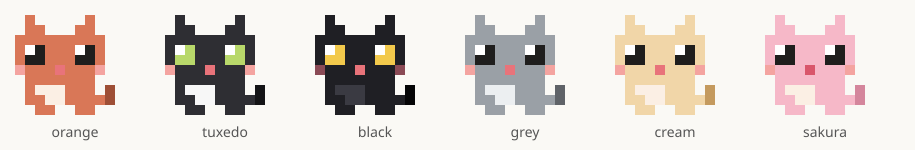
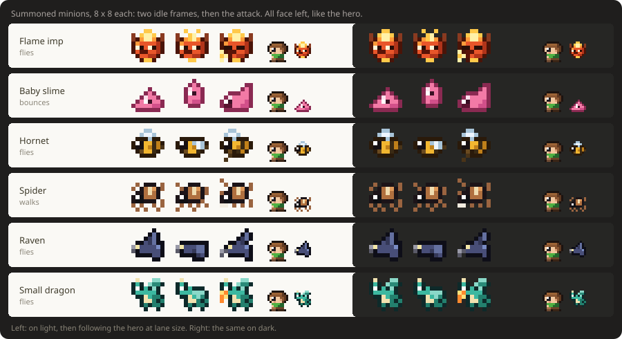
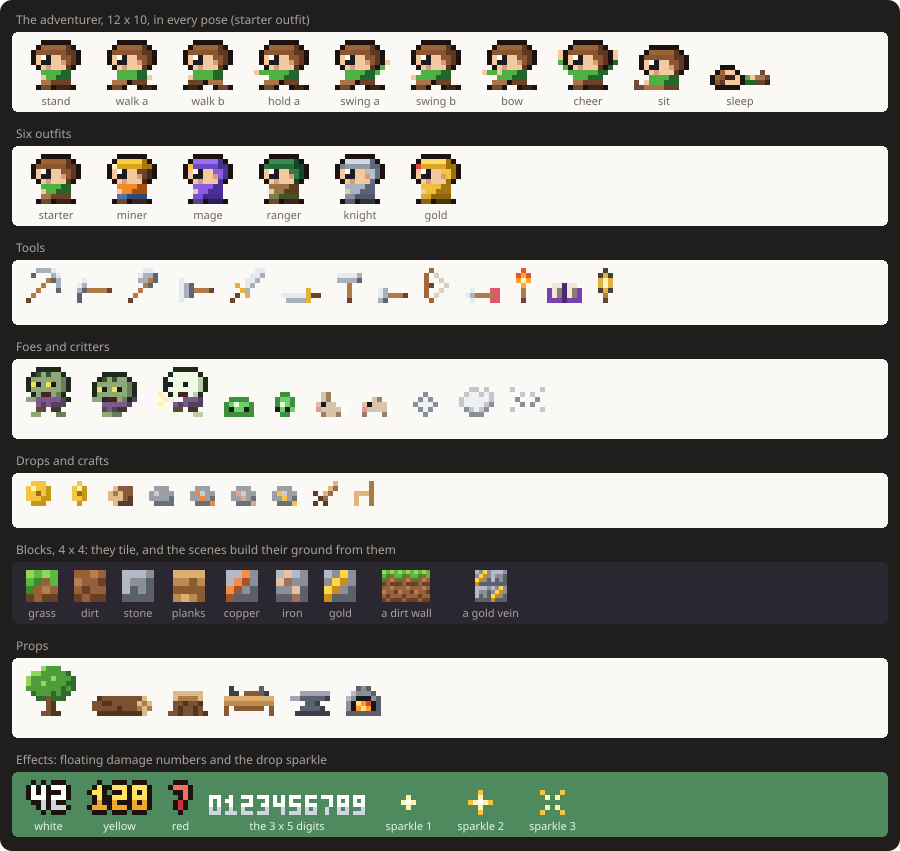

# Pixel Cat 🐱

A tiny pixel-art cat that lives above your [Claude Code](https://claude.com/claude-code) prompt. It wanders around, watches your usage limits, and tells you when Claude finishes. Not a cat person? Switch packs and an adventurer mines, chops trees and fights zombies there instead.


## What it does

- **Wanders** back and forth above the prompt, sits down now and then, and blinks.
- **Works alongside Claude**, with a speech bubble showing the current tool (`‹Bash…›`) and a prop to match: a book for reading files, a laptop it types on for edits, a terminal for shell commands, a magnifying glass for searches. Between tools it runs around.
- **Announces when a turn finishes** (`‹done! 42s›`), plus a toast for turns longer than 20 seconds.
- **Reacts to failures** with a `>.<` face when a tool call errors.
- **Food bowl = context:** a bowl at the right end empties as the conversation fills up. Near the limit the cat mentions it; when the conversation is compacted, the bowl refills ("nom nom!").
- **Tracks your limits:** shows your 5-hour, 7-day and context usage in green, yellow or red. It gets sleepy at 80% of the 5-hour limit and sends a toast at 75% and 90%.
- **Keeps itself busy while you're idle**, mostly calmly (strolling, sitting, grooming itself, napping), with play now and then:
  - chases a ball of yarn, follows a butterfly, hops around, and takes little cat naps
  - hunts a mouse, and sometimes pins it under a paw (before it wriggles free and runs off)
  - stalks a bird, pounces ("nom?!"), and watches it fly away
  - goes fishing: a fishbowl, a fish tank or a river, depending on the scene, and sometimes catches one
  - chases a laser pointer dot back and forth until it vanishes ("where'd it go?")
  - **mischief:** finds a mug on a table, taps it… and knocks it off ("*CRASH*", "oops :3"), or sits right on top of your usage stats until you pet it
  - **at night** (9pm–5am, when the scenes turn dark) it mostly naps

  

  

  
- **Goes to bed on its perch** after 5 minutes of inactivity, or when your 5-hour limit runs out. The perch slides in from the left (a cat bed, a tree stump, a cloud or a cat tree, depending on the scene), the cat walks over, hops up and curls up. On your next prompt it wakes and the perch slides away.

  
- **Speech bubbles** that type themselves out, with animated dots, hearts and sparkles.
- **Little animations** in between: tail wags, ear twitches, a shake when something fails, and drifting z's while it naps.
- **Your own cat:** each install rolls a marking (a white blaze, socks, a tail tip or a spot) and has a 1 in 50 chance of being ✨ shiny, with sparkles. `/cat` shows yours.
- **Hats to unlock:** a party hat at 10 finished tasks, a beanie at 100 tool calls, a crown at 150 tasks and a wizard hat at 500 tool calls. You get a popup when one unlocks; wear it from ⚙ → Hat.
- **Time of day:** the Grass scene gets dawn, dusk and starry-night skies, the Cozy room gets a window showing the sky outside (with the moon at night), and Clear shows a few stars at night.
- **Pet ♥** button (it purrs, with floating hearts, and wakes up if it was asleep) and **Hide** button.
- **⚙ Settings**, saved across sessions:
  - **Coat:** Orange, Tuxedo, Black, Grey, Cream or Sakura

    

  - **Speed:** Chill, Normal or Zoomies
  - **Scene:** Clear (follows your light/dark theme), Grass, Night or Cozy. The scene also picks the perch and the fishing spot.
  - **Popups:** on or off
  - **Hat:** any you've unlocked
  - **Usage:** show or hide the limit numbers
- **`/cat`** toggles it and prints your current limits and when the 5-hour window resets.

In the Claude desktop app the whole lane is one SVG that animates itself (smooth gliding, leg and tail frames, blinks, floating hearts and z's), so the mod only redraws when the cat changes what it's doing. In the terminal the lane is a cell grid of colored half blocks, repainted in place 10 times a second.

## Packs

Everything the hero is and does comes from a pack. Switch packs from ⚙ → **Pack**. Each pack remembers its own coat (or outfit), scene and hat, so switching back finds them as you left them; a pack you haven't worn yet starts from its defaults, keeping only what it shares with the one you left. Hats unlock at the same milestones in every pack, so a hat earned in one is waiting in the others.

- **Cat:** everything above.
- **Adventurer:** mines ore out of blocks as cracks spread across them, chops a tree until it falls, builds a little wall or a staircase block by block, and crafts a chair or a blade at a workbench, furnace or anvil. Zombies shamble in, far more often at night (a slime in the forest by day), and get the sword or, 40% of the time, the bow, with a coin for the trouble. A bunny hops by now and then. While Claude works it reads (Read), hammers at the anvil (edits), works the furnace (shell commands) or searches by lantern or torch. The food bowl becomes a potion that drains as the context fills. Six outfits (Starter, Miner, Mage, Ranger, Knight, Gold), four scenes (Forest, Cavern, Night, Cabin) each with its own bed, and its own hats: a feather, a horned helm, a crown and a wizard hat.

  

  The Adventurer pack is fan-made and inspired by Terraria. It is not affiliated with or endorsed by Re-Logic, and Terraria is a trademark of Re-Logic. All of its pixel art is original.

## Your agents, on screen

Each agent this session runs (a subagent, in the background or not, or a teammate while it is running) shows up behind the hero for as long as it works: a kitten trotting after the cat, or a summoned minion following the adventurer (an imp, a slime, a hornet, a spider or a raven, by its place in the line, so each agent keeps its creature). Flyers hover, the rest keep to the ground. They join in, too: kittens pounce with the cat, and summons charge the foe in a fight, with a damage number for every hit. When the hero turns they walk round to its back; near the edge of the lane, where there is no room behind it, they wait in front of it instead, and while it sleeps they settle past the foot of its bed. When an agent finishes, its follower hops and vanishes in a puff. Up to five are drawn, then "+N" (the terminal draws one for every 30 columns). Only this session's agents count; a workflow's agents are not counted. `/cat` shows how many are working.



## Switching mods

The **↻** button at the right of the band walks a loop: **Cat → Adventurer → Token Tycoon → Off → Cat**; its label names the next stop. On Token Tycoon's stop this band draws nothing and the game takes the spot (it's told through its `/tycoon` command, so it only joins the loop when it's installed). On Off, only a one-line **↻ Cat** strip stays, to come back from. The stop is saved with your prefs, so a new session opens where you left it.

`/mods` does the same from the keyboard: alone it moves to the next stop, `/mods cat`, `/mods adventurer`, `/mods tycoon` or `/mods off` picks one. **Hide** and `/cat` still hide the cat for this session only, without moving the loop.

## Install

Pixel Cat ships from the [matthlh/claude-mods](https://github.com/matthlh/claude-mods) marketplace, together with [Token Tycoon](../token-tycoon) and [Purple Dark](../purple-dark). You need a Claude Code version that supports mods (October 2026 or later); the same steps work on macOS, Linux and Windows. At the Claude Code prompt, type:

```
/plugin marketplace add matthlh/claude-mods
/plugin install pixel-cat@matthlh
```

The cat shows up right away, and in every new session after that, desktop app included. Or from a shell:

```bash
claude plugin marketplace add matthlh/claude-mods
claude plugin install pixel-cat@matthlh
```

Update with `claude plugin update pixel-cat@matthlh`, remove with `claude plugin uninstall pixel-cat@matthlh`.

**No cat?** Mods are still rolling out. Add `"CLAUDE_CODE_ENABLE_FUNCTION_HOOKS": "1"` to the `env` block of `~/.claude/settings.json` and start a new session (quit the desktop app fully, not just the window).

### From a clone

To change the cat, run your own copy instead:

```bash
git clone https://github.com/matthlh/claude-mods ~/.claude/mods/claude-mods
claude --plugin-dir ~/.claude/mods/claude-mods/plugins/pixel-cat
```

To load the clone in every session, including the desktop app, put the plugin folder's full path in `CLAUDE_CODE_PLUGIN_DIRS` in the `env` block of `~/.claude/settings.json`; the [top-level README](../../README.md#run-from-a-clone) has the per-OS paths.

## Customize

The sprites are 12×10 grids of letters in [`hooks/packs/cat/sprites.ts`](hooks/packs/cat/sprites.ts):

| Letter | Color |
| --- | --- |
| `o` | fur (Claude orange) |
| `d` | shade |
| `H` / `K` | eye shine / eye |
| `r` | blush |
| `n` | nose |
| `w` | chest |

Edit the grids or the `COATS` to make a tuxedo, calico or black cat. In an interactive session, saving the file hot-reloads the mod.

Everything the cat is lives in one pack, [`hooks/packs/cat/`](hooks/packs/cat): its sprites, coats, scenes, hats and activities. The lane machinery in [`hooks/engine/`](hooks/engine) reads a pack through the interface in [`hooks/packs/types.ts`](hooks/packs/types.ts), so a new pack is one folder plus an import and an entry in `admit([...])` in [`hooks/packs/index.ts`](hooks/packs/index.ts). The engine owns what every pack shares: the time of day (night is 9pm–5am), blinks, the room above the sprite where hats go, and the four milestones that unlock a hat; a pack brings one hat for each. An activity is one entry in the pack's `activities`: its weights, how it moves, its pose, what it leads into, its lines, and its drawing on both surfaces. The engine names only two activity ids itself, bedtime's `bed` and `perch`; they are reserved, and [`hooks/packs/index.ts`](hooks/packs/index.ts) refuses a pack that defines either, or whose `roles` name an activity it doesn't have.

Check your changes with:

```bash
claude plugin validate ~/.claude/mods/claude-mods/plugins/pixel-cat
claude plugin test ~/.claude/mods/claude-mods/plugins/pixel-cat
npx -p typescript tsc -p ~/.claude/mods/claude-mods/plugins/pixel-cat
```

The last line type-checks the mod with the engine's strict settings (Claude Code writes them to `.claude-plugin/types/` when it loads the mod; the plugin's `tsconfig.json` extends them, leaving out the frozen golden test). The tests draw the band on the desktop and terminal surfaces, press the buttons, and draw every activity of every pack and the bed in every scene, so a drawing the engine would refuse fails there instead of silently disappearing. They also follow every activity's `then` and fail on one that leads nowhere, since a typo there would otherwise become a plain wander.

### Make your own pack

1. Copy [`hooks/packs/adventurer/`](hooks/packs/adventurer) to `hooks/packs/<yours>/`. In its `index.ts`, rename the export (`export const yours: Pack`) and give it a new `id`, `label` and `noun`.
2. Redraw the sprites, outfits and scenes, and change the activities. Each activity is drawn with the track helper in [`hooks/engine/track.ts`](hooks/engine/track.ts): a sprite, where it sits and how it moves over the leg, drawn the same on both surfaces.

   The Adventurer's own sprites, every pose, tool, foe, block and prop, are on one sheet to start from:

   

3. Register it in [`hooks/packs/index.ts`](hooks/packs/index.ts): `import { yours } from './<yours>/index'` and add it to `admit([cat, adventurer, yours])`.
4. Check it:

   ```bash
   claude plugin validate ~/.claude/mods/claude-mods/plugins/pixel-cat
   claude plugin test ~/.claude/mods/claude-mods/plugins/pixel-cat
   ```

The tests pick up every registered pack on their own: each activity is drawn in every scene, at several moments through its leg, on both surfaces, and each of those desktop drawings has to stay under the 131,072-character limit.
